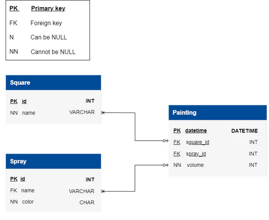

# Stage 6/6: Empty White Squares
## Description
In the last part of your creative journey, turn your attention to the canvas's white squares. Your goal is to find all the white squares that were only painted with spray cans, now without any paint. Explore the simplicity of these plain white spaces, revealing the core of your canvas without the lively colors.

## Objectives
- Identify the `name` of white squares from the `Square` table exclusively painted with now-empty spray cans  
  in the coloring database.  
- Use a query that selects square names from the `Square` table, filtering for squares where the `SUM` of the  
  paint volume is `765` and painted by spray cans which are empty after all paintings are done.  
- Ensure results are sorted by `square_id`s.  
- Employ **subqueries** for precise filtering of spray cans and white squares.  
- Use the `GROUP BY`, `JOIN`, and `HAVING` functions to achieve the task.

**Hint**: _To accomplish the task you may use queries from Stages 4 and 5._

Take a look at the following database structure:



## Explanation of the database:
The Coloring Database encompasses three main tables: painting, spray, square.

In-depth details of each table are as follows:

The `**Square**`** table represents individual squares that can be painted using spray cans. It contains the following columns:
  - `id`: A unique identifier for each square.
  - `name`: The name or label associated with the square.

The `**Spray**`** table contains information about different spray paint cans. It includes the following columns:
  - `id`: A unique identifier for each spray can. 
  - `name`: The name or label associated with the spray can.
  - `color`: The color of the spray can, is represented only by a single character ('R' for red, 'G' for green, 'B' for blue).

The `**Painting**`** table is used to track the painting activity on squares using spray cans. It includes the following columns:
  - `datetime`: The timestamp indicating when the painting occurred with an accuracy of a second, not milliseconds.
  - `square_id`: A reference to the square being painted, linking to the id column in the Square table.
  - `spray_id`: A reference to the spray can be used for painting, linking to the id column in the Spray table.
  - `volume`: The amount of paint applied during the painting process.

## Additional information and rules to consider:
- The volume of the spray can is `initially set to 255`, and it decreases as the can is used for painting.
- The color of the square is determined by the RGB rule, with (R=0, G=0, B=0) representing `black` and  
  (R=255, G=255, B=255) representing `white`.
- The entry in the Painting table `reduces` the amount of paint in the spray can by the specified volume column  
  and `increases` the amount of paint in the square by the same amount.
- The volume value should be in the range of` 0 < volume <= 255`.
- The amount of paint in a square of the `same color cannot exceed 255`, and  
  the amount of paint in a `spray can not be less than zero`.

** Table names are case-sensitive

Click on the [link](Database.sql) to download the SQL query for creating the database.

## Example

_Square Table Example:_

| id | name    |
|----|---------|
| 1  | Square1 |
| 2  | Square2 |
| 3  | Square3 |

_Painting Table Example:_

| datetime            | square_id | spray_id | volume |
|---------------------|-----------|----------|--------|
| 2020-01-01 01:13:36 | 1         | 1        | 255    |
| 2020-01-01 02:13:36 | 1         | 2        | 255    |
| 2020-01-01 03:13:36 | 1         | 3        | 255    |
| 2020-01-01 04:13:36 | 2         | 4        | 255    |
| 2020-01-01 05:13:36 | 2         | 5        | 255    |
| 2020-01-01 06:13:36 | 2         | 6        | 100    |
| 2020-01-01 07:13:36 | 2         | 7        | 155    |
| 2020-01-01 08:13:36 | 3         | 6        | 100    |
| 2020-01-01 09:13:36 | 3         | 7        | 50     |

From the data presented in the table above, it is evident that `Square1` and `Square2` are white because both of them  
have a total painted volume of `765`. However, among them, `Square1` was painted with spray cans that are now empty  
after all paintings, while the spray cans used for painting `Square2` still have some dye.  
The resulting table displays white squares that were exclusively painted with spray cans, now without any  
paint after all paintings, sorted by square names:

| name    |
|---------|
| Square1 |


## Query template:
```markdown
SELECT name ...;
```